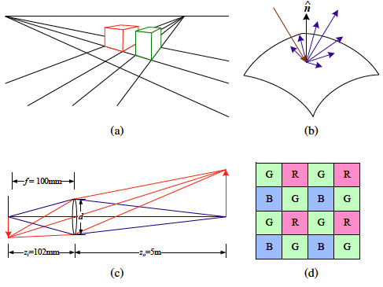
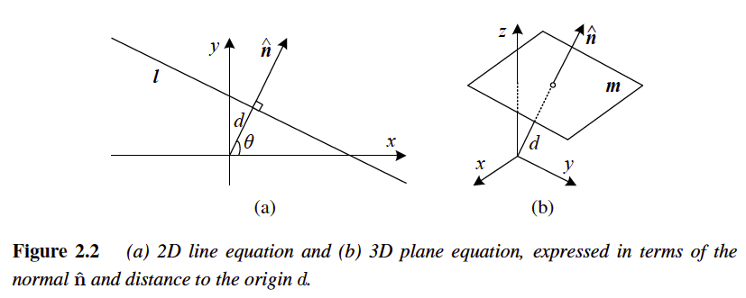

# Szeliski Book

## Chapter 2: Image Formation

This is a few components of the image formation process.

* (a) perspective projection.
* (b) light scattering when hitting a surface.
* (c) lens optics.
* (d) Bayer color filter array.

### 2.1 Geometric Primitives and Transformations

Below is definitions that will be used in understanding the image formation process.

**2D Points** 

2D points (pixel coordinates in an image) can be denoted using a pair of values $\textbf{x} = (x,y) \in \mathbb{R}^2$, which is alternatively know as: 
$$\textbf{x} = \begin{bmatrix} x \\ y \end{bmatrix}.$$ 

2D points can also be represented using *homogeneous coordinates*, $\stackrel{\sim}{\textbf{x}} = (\stackrel{\sim}{x},\stackrel{\sim}{y},\stackrel{\sim}{w}) \in \mathbb{P}^2$, where vectors that differ only by scale considered to be equivalent. $\mathbb{P^2} = \mathbb{R^3} - (0,0,0)$, this is called the 2D *projective space*.

Just as a reminder, homogenous coordinates are a system of coordinates for projective geometry. This helps us express transformations as a matrix. We can also express points at infinity. For a small example, lets say we have the following vector: 

$$\mathbb{v} = \begin{bmatrix} a \\ b\end{bmatrix} \rightarrow \begin{bmatrix} a \\ b \\ 1\end{bmatrix}$$

To make this vector a homogenous vector we will add a third coordinate of 1 (in $n$-dimensions we just add one more coordinate to the vector) and then it becomes a homogenous vector.

A homogenous vector $\stackrel{\sim}{\textbf{x}}$ can be converted back into an *inhomogeneous vector* $x$ by dividing through the last element by something like $\stackrel{\sim}{w}$, as we do in the example below:

$$\stackrel{\sim}{\textbf{x}} = (\stackrel{\sim}{x},\stackrel{\sim}{y},\stackrel{\sim}{w}) = \stackrel{\sim}{w}(x,y,1) = \stackrel{\sim}{w}\stackrel{-}{\textbf{x}},$$

where $\stackrel{-}{\textbf{x}} = (x,y,1)$ is the *argument vector*. Homogenous points whose last element is $\stackrel{\sim}{w} = 0$ are called *ideal points* or *points at infinity* and do not have an equivalent inhomogeneous representation.

**2D Lines**

2D lines can also be represented using homogeneous coordinates $\stackrel{\sim}{\textbf{l}} = (a,b,c)$. The corresponding *line equation* is 
$$\stackrel{-}{\textbf{x}} \cdot \stackrel{\sim}{\textbf{l}} = ax + by + c = 0.$$

We can normalize the line equation vector so that $\textbf{l} = (\hat{n_x}, \hat{n_y}, d) = (\hat{\textbf{n}},d)$ with $||\hat{\textbf{n}}|| = 1$. In this case, $\hat{\textbf{n}}$ is the *normal vector* perpendicular to the line and $d$ is its distance to the origin. (The one exception to this normalization is the *line at infinity* $\stackrel{\sim}{\textbf{l}} = (0,0,1)$, which includes all (ideal) points at infinity). 

We can also express $\hat{\textbf{n}}$ as function of rotation angle $\theta$,  $\hat{\textbf{n}} = (\hat{n_x}, \hat{n_y}) = (\cos \theta, \sin \theta)$. This representation is commonly used in *Hough transform* line-finding algorithm. 

When using homogeneous coordinates, we can compute the intersection of two lines as

$$\stackrel{\sim}{\textbf{x}} = \stackrel{\sim}{\textbf{l}}_1 \times \stackrel{\sim}{\textbf{l}}_2$$

where $\times$ is the cross product. We can join the two lines by 

$$\stackrel{\sim}{\textbf{l}} = \stackrel{\sim}{\textbf{x}}_1 \times \stackrel{\sim}{\textbf{x}}_2$$

When trying to fit an intersection point to multiple lines or, conversely, a line to multiple points, the least squares techniques can be used.

2D Conics:

There are other algebraic curves that can be expressed with simple polynomial homogeneous equations, like *conic sections*, because they arise as the intersection of a plane and a 3D cone, can be written using a quadric equation

$$\stackrel{\sim T}{\textbf{x}} Q \stackrel{\sim}{\textbf{x}} = 0$$

These quadric equations play useful roles in study of multi-view geometry and camera calibration.

3D Points

Just like in 2D we can write a inhomogeneous coordinates $\textbf{x} = (x,y,z) \in \mathbb{R^3}$ or homogenous coordinates $\stackrel{\sim}{x} = (\stackrel{\sim}{x}, \stackrel{\sim}{y}, \stackrel{\sim}{z}, \stackrel{\sim}{w}) \in \mathbb{P^3}$

